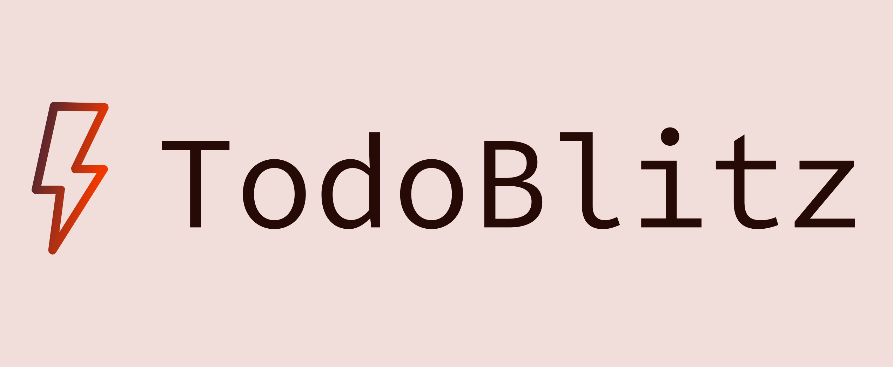

    

# todoblitz

Todo app created with Django and Vuejs

## Project Structure

1. Project Structure

   The project is divided into two main sub-projects:

   1. `todo_client`: This is the frontend of the application, created with Vue.js. It allows users to add, edit, delete, and mark todos as completed. [View Documentation](./todo_client/README.md)
   2. `todoapi`: This is the backend API of the application, created with Django and Django REST framework. It provides endpoints for creating, retrieving, updating, and deleting todos. [View Documentation](./todoapi/README.md)
